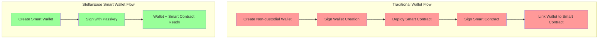

# 🌟 StellarEase Smart Wallet: The Future of Web3 Authentication

## 🚀 Overview

Welcome to our revolutionary Smart Wallet implementation! We're not just building another wallet - we're redefining what it means to interact with blockchain technology. By leveraging cutting-edge technologies like passkeys and smart contracts, we've created a solution that bridges the gap between traditional wallets and the future of Web3.

## 💡 The Problem

Traditional wallets face significant challenges:
- **Custodial Wallets**: Require users to manage 24-word seed phrases, creating a high barrier to entry
- **Non-custodial Wallets**: While they can sign smart contracts, they require separate steps for wallet creation and smart contract deployment
- **Smart Contract Integration**: Traditional wallets require additional authentication and separate transactions to implement programmable rules
- **Complex Setup**: Users must manage multiple steps: create wallet, deploy smart contract, link them together

## 🛠️ Our Solution

We've built a next-generation smart wallet that combines:
- **Passkey Authentication**: Secure, passwordless authentication using WebAuthn
- **Integrated Smart Contracts**: Wallet creation and programmable rules in a single authentication flow
- **Programmable Rules**: Built-in spending limits and budget controls
- **Modern Tech Stack**: Built with Next.js for optimal performance and developer experience

### Key Technologies

#### 🎯 LaunchTube Integration
LaunchTube enables seamless smart contract deployment on the Stellar network. Instead of dealing with complex token management and faucets, we've streamlined the process through LaunchTube's powerful infrastructure.

#### 🔄 Mercury Layer
Our implementation uses Mercury as an intelligent abstraction layer that:
- Deploys Zephyr programs for efficient RPC interaction
- Provides organized, structured access to blockchain data
- Simplifies complex blockchain operations
- Enables programmable spending rules through smart contracts

#### 💪 Stellar SDK Integration
We've harnessed the full power of the Stellar SDK to:
- Implement passkey-based authentication
- Manage sophisticated signer systems
- Handle complex balance operations
- Create a truly decentralized experience
- Enforce programmable spending rules

### Smart Contract Features

Our wallet goes beyond traditional smart contract wallets by integrating programmable rules directly into the wallet creation process:

#### Budget Control
When creating a wallet with the passkey name `budget`, the smart contract enforces:
- Daily spending limits (e.g., 100 XLM per day)
- Transaction amount validation
- Automatic rejection of transactions exceeding limits
- Daily reset of spending allowances

#### Allowance Management
When using the passkey name `allowance`, the smart contract provides:
- Granular control over transaction amounts
- Time-based spending restrictions
- Category-based spending limits
- Automatic transaction validation

### Wallet Setup Flow Comparison

## 🏗️ Technical Architecture

### Frontend Improvements
- **Next.js Framework**: Leveraging server-side rendering and API routes
- **TypeScript Integration**: Ensuring type safety and better developer experience
- **Modern UI/UX**: Clean, intuitive interface designed for mass adoption
- **Smart Contract Dashboard**: Visual interface for managing spending rules

### Backend Architecture
- **Server-Side API Routes**: Efficient handling of blockchain operations
- **React Hooks**: Reusable, maintainable code structure
- **TypeScript Components**: Type-safe implementation throughout
- **Smart Contract Integration**: Seamless interaction with programmable rules

## 🌈 What Makes Us Different?

| Feature | Traditional Wallets | Our Smart Wallet |
|---------|-------------------|------------------|
| Authentication | Seed Phrases | Passkeys |
| Control | Basic | Programmable Rules |
| Security | Basic | Advanced |
| User Experience | Complex | Intuitive |
| Spending Limits | None | Built-in |
| Smart Contract Setup | Separate Steps | Integrated Creation |

## 🚀 Future Roadmap

We're not stopping here! Our vision extends far beyond the current implementation:

1. **Advanced Smart Contract Features**
   - Custom spending rule templates
   - Multi-signature support with programmable rules
   - Time-locked transactions
   - Category-based spending limits

2. **Ecosystem Growth**
   - Expanding the smart wallet tech stack
   - Encouraging developer adoption
   - Building a vibrant community
   - Creating a marketplace for spending rule templates

3. **Enhanced Features**
   - Advanced transaction analytics
   - Cross-chain compatibility
   - Automated budget management
   - AI-powered spending insights

## 🎯 Impact

Our solution addresses critical challenges in the Web3 space:
- **Accessibility**: Making blockchain technology accessible to everyone
- **Security**: Implementing state-of-the-art authentication
- **Decentralization**: Maintaining true decentralization while improving user experience
- **Control**: Providing programmable spending rules without sacrificing security
- **Simplicity**: Combining wallet creation and smart contract deployment into a single step

## 🤝 Join Us

We're building the future of Web3 authentication and programmable finance. Join us in revolutionizing how people interact with blockchain technology!

---

*Built with ❤️ for the Stellar Community* 