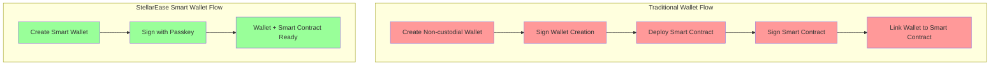

# 🌟 StellarEase Smart Wallet: The Future of Web3 Authentication

## 🚀 Overview

Welcome to our revolutionary Smart Wallet implementation! We're not just building another wallet - we're redefining what it means to interact with blockchain technology. By leveraging cutting-edge technologies like passkeys and smart contracts, we've created a solution that bridges the gap between traditional wallets and the future of Web3.

### 🎥 Quick Demo
(https://111test.s3.cubbit.eu/stellareaseshort.mp4)

### ✨ Key Features

#### 💰 Asset Management

Our intuitive dashboard provides a clear overview of your assets with rich, interactive cards showing real-time balances and market data. Manage multiple assets seamlessly in one place.

#### 💱 Easy Token Operations

Purchase XLM directly with USD through our integrated exchange interface, making it easy to get started with Stellar.

#### 👥 Contact Management

Store and manage your frequently used contacts for quick and easy transactions. Our contact system makes sending assets as simple as traditional banking apps.

#### 📊 Transaction History

Track all your transactions with detailed history and status updates. Monitor your spending and earning patterns with our comprehensive transaction view.

#### 📱 Receive Assets

Share your wallet address easily with options to copy the contract ID or download a QR code. Perfect for both in-person and remote transactions.

#### 💸 Send Assets

Send assets to your contacts with a familiar, banking-style interface. Select recipients from your contact book and specify amounts with ease.

## 💡 The Problem

Traditional wallets face significant challenges:
- **Custodial Wallets**: Require users to manage 24-word seed phrases, creating a high barrier to entry
- **Non-custodial Wallets**: While they can sign smart contracts, they require separate steps for wallet creation and smart contract deployment
- **Smart Contract Integration**: Traditional wallets require additional authentication and separate transactions to implement programmable rules
- **Complex Setup**: Users must manage multiple steps: create wallet, deploy smart contract, link them together

## 🛠️ Our Solution

We've built a next-generation smart wallet that combines:
- **Passkey Authentication**: Secure, passwordless authentication using WebAuthn
- **Integrated Smart Contracts**: Wallet creation and programmable rules in a single authentication flow
- **Programmable Rules**: Built-in spending limits and budget controls
- **Modern Tech Stack**: Built with Next.js for optimal performance and developer experience

### Key Technologies

#### 🎯 LaunchTube Integration
LaunchTube enables seamless smart contract deployment on the Stellar network. Instead of dealing with complex token management and faucets, we've streamlined the process through LaunchTube's powerful infrastructure.

#### 🔄 Mercury Layer
Our implementation uses Mercury as an intelligent abstraction layer that:
- Deploys Zephyr programs for efficient RPC interaction
- Provides organized, structured access to blockchain data
- Simplifies complex blockchain operations
- Enables programmable spending rules through smart contracts

#### 💪 Stellar SDK Integration
We've harnessed the full power of the Stellar SDK to:
- Implement passkey-based authentication
- Manage sophisticated signer systems
- Handle complex balance operations
- Create a truly decentralized experience
- Enforce programmable spending rules

### Smart Contract Features

Our wallet goes beyond traditional smart contract wallets by integrating programmable rules directly into the wallet creation process:

#### Spending Limit Control
When creating a wallet with the passkey name `spending_limit`, the smart contract enforces:
- Maximum daily spending of 100 XLM
- Transaction amount validation
- Automatic rejection of transactions exceeding the limit
- Daily reset of spending allowance
- Perfect for controlled spending or shared accounts

#### Earning Limit Control
When using the passkey name `earning_limit`, the smart contract provides:
- Maximum daily incoming transactions of 100 XLM
- Automatic rejection of incoming payments exceeding the limit
- Daily reset of earning allowance
- Ideal for receiving payments or managing income streams
- Protection against unexpected large deposits

### Wallet Setup Flow Comparison

## 🏗️ Technical Architecture

### Frontend Improvements
- **Next.js Framework**: Leveraging server-side rendering and API routes
- **TypeScript Integration**: Ensuring type safety and better developer experience
- **Modern UI/UX**: Clean, intuitive interface designed for mass adoption
- **Smart Contract Dashboard**: Visual interface for managing spending rules

### Backend Architecture
- **Server-Side API Routes**: Efficient handling of blockchain operations
- **React Hooks**: Reusable, maintainable code structure
- **TypeScript Components**: Type-safe implementation throughout
- **Smart Contract Integration**: Seamless interaction with programmable rules

### Smart Contract Deployment
The smart wallet and its two policy types (spending limits and earning limits) have been compiled into WebAssembly for optimal performance and security. To interact with these contracts, you'll need:

1. **Required JWTs**:
   - LaunchTube JWT for smart contract deployment
   - Mercury JWT for RPC interaction

2. **Stellar Network Configuration**:
   - Network: Stellar
   - Horizon URL: https://horizon.stellar.org
   - Network Passphrase: Public Global Stellar Network ; September 2015
   - RPC Endpoint: https://soroban-rpc.stellar.org

3. **Contract Generation**:
   - Smart wallet and policy contracts are dynamically generated during the passkey signing process
   - Each wallet creation with a passkey automatically deploys the appropriate smart contract
   - Contract addresses are unique per wallet and are generated based on the passkey signature
   - No manual contract deployment or address management required

## 🌈 What Makes Us Different?

| Feature | Traditional Wallets | Our Smart Wallet |
|---------|-------------------|------------------|
| Authentication | Seed Phrases | Passkeys |
| Control | Basic | Programmable Rules |
| Security | Basic | Advanced |
| User Experience | Complex | Intuitive |
| Spending Limits | None | Built-in |
| Smart Contract Setup | Separate Steps | Integrated Creation |

## 🚀 Future Roadmap

We're not stopping here! Our vision extends far beyond the current implementation:

1. **Advanced Smart Contract Features**
   - Custom spending rule templates
   - Multi-signature support with programmable rules
   - Time-locked transactions
   - Category-based spending limits

2. **Ecosystem Growth**
   - Expanding the smart wallet tech stack
   - Encouraging developer adoption
   - Building a vibrant community
   - Creating a marketplace for spending rule templates

3. **Enhanced Features**
   - Advanced transaction analytics
   - Cross-chain compatibility
   - Automated budget management
   - AI-powered spending insights

## 🎯 Impact

Our solution addresses critical challenges in the Web3 space:
- **Accessibility**: Making blockchain technology accessible to everyone
- **Security**: Implementing state-of-the-art authentication
- **Decentralization**: Maintaining true decentralization while improving user experience
- **Control**: Providing programmable spending rules without sacrificing security
- **Simplicity**: Combining wallet creation and smart contract deployment into a single step

## 🤝 Join Us

We're building the future of Web3 authentication and programmable finance. Join us in revolutionizing how people interact with blockchain technology!

---

*Built with ❤️ for the Stellar Community* 